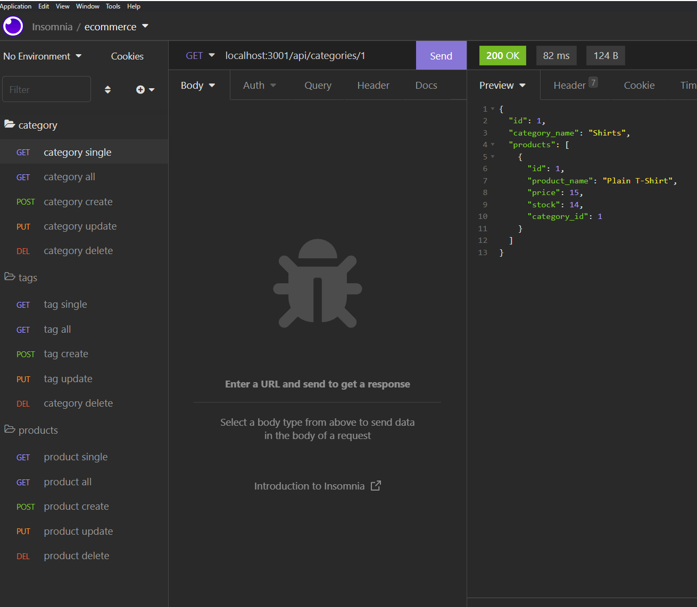
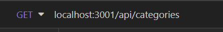
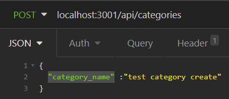
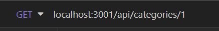
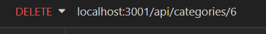

# e-commerce-back-end

## Description 

This is an example of a backend deployement for e-commerce. It utilizes Insomnia to handle get, post, put, and delete requests onto a database.

### [Demo Video](https://www.youtube.com/watch?v=5pzLOKO-1wI)

## Table of Contents

* [Installation](#installation)
* [Usage](#usage)
* [Credits](#credits)
* [License](#license)


## Installation

Clone repository and run on local machine. To install necessary dependencies, run the following command:
```npm i```


Create a .env file to authorize mysql.
Within your terminal, run the command ```npm run seed``` or ```node seeds/index.js```


## Usage 

Initialize the server using ```npm start```

To use the application, we need insomnia to handle what kind of request we are handing to what table in the database.
See below for example of the different requests for different tables. 



There are 3 different database tables able to be accessed through the /api/... route on the local host, categories, tags, and products. We can then access different reqeusts through the different routes. We can handle get and post requests at the root of each.


  

There are also ways to single out a single category, tag, product by adding a /number at the end of the apis 



To update an item, the id number of the to be updated needs to be provided and within the body of the request will need the updated values for the specific columns on the respective database's table 

A delete request is similar syntax to a get request for a single item, but utilizes the delete rather than get.



For any uncertainty, refer to demo video for any questions

## Credits

[Nodejs](https://nodejs.org/dist/latest-v16.x/docs/api/)

[mysql2](https://www.npmjs.com/package/mysql2)

[dotenv](https://www.npmjs.com/package/dotenv)

[Express](https://www.npmjs.com/package/express)

[Sequelize](https://www.npmjs.com/package/sequelize)

[Insomnia](https://docs.insomnia.rest/)

## License

 This project is licensed under the MIT license.

[](https://opensource.org/licenses/MIT)